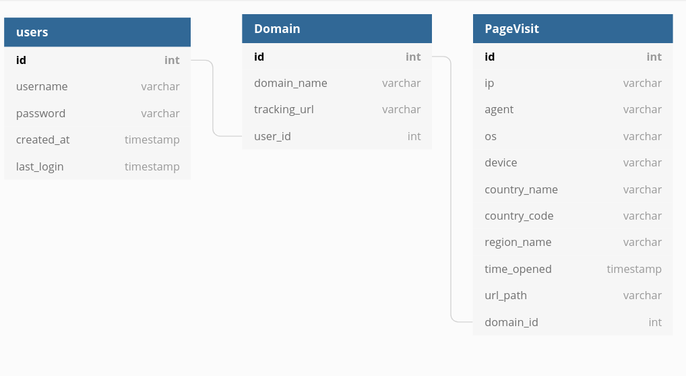

# GPixel

GPixel is an application that, utilizes html  tags to collect site analytics.

## Web App Usage:

**Login: /login**

Typical login functionality. Provide a valid username/password combination to authenticate to the application.

**Register: /register**

Registration functionality. Provide a valid username, email and password combination to login to the application. The password policy enforced by the application is described in the form.

**Logout: /logout**

Visit this URI to log out.

**Main View: /**

The main view of the application shows the domain data collected so far, along with the html `` tag used for tracking the given domain. The user can toggle between the registered domains. To start tracking a registered domain, the user has to include the tracking snippet in the domain's code base. The suggested place is in the `<header>`, as show below.

```html
<head>
...
    <!-- gpixel tracker -->
    
...
</head>
```

**Settings: /settings**

The settings tab provides the following functionality:

1. Domain Registration.
2. Delete a registered Domain.
3. Password Change.

## ER Diagram



## Analytic Services and User Privacy 

Modern site analytics services (Google Analytics, Facebook Pixel, etc.) collect more information, than people should be comfortable with. Practically embedding an analytics service to your website, means adding 3rd-party scripts, that track user information. This is done by setting tracking cookies for Internet wide tracking, gathering device, browser and geo  information or using more complex techniques, such as performing complex operations to identify hardware specifications.

The collected information are way more than what a site maintainer needs for tracking and optimizing access to the provided content, and are used by the 3rd-party provider to build a profile for sites visitors in order to track them across the web, which rises concerns about what information are exposing and to who, with the use of such a services.

Last but not least, when choosing an analytics solution one must keep in mind that most anti tracking mechanisms, block most widely used trackers by default. As an example the case of Google analytics is examined below.

## Google analytics Privacy Information

**Privacy Policy:**

Collected: Anonymous (Ad Views, Analytics, Browser Information, Cookie Data , Date/Time,  Demographic Data, Hardware/Software Type, Internet Service Provider,  Interaction Data , Page Views , Serving Domains)

Pseudonymous (IP Address (EU PII), Search History, Location Based Data, Device ID (EU PII))

PII (Name , Address, Phone Number, Email Address, Login, EU- IP Address, EU- Unique Device ID )

**Data Sharing:**

Aggregate data is shared with 3rd parties.

Anonymous data is shared with 3rd parties.

PII data is shared with 3rd parties.

Sensitive data is shared with 3rd parties.

**Google operates:**

AdMeld, AdMob, Adometry, Apture, Channel Intelligence,  Custom Search Ads, DoubleClick, DoubleClick Ad Exchange-Buyer,  DoubleClick Ad Exchange-Seller, DoubleClick Bid Manager, DoubleClick  DART, DoubleClick Floodlight, DoubleClick Spotlight, Doubleclick Video  Stats, FeedBurner, GA Audiences, GDN Notice, Google Ads Measurement,  Google Adsense, Google Adsense, Google Adsense Asynchronous, Google  AdServices, Google AdWords Conversion, Google Adwords User Lists, Google Affiliate Network, Google AJAX Search API, Google Analytics, Google  API, Google Commerce, Google Custom Search, Google Custom Search Engine, Google Display Network, Google Dynamic Remarketing, Google Fonts,  Google FriendConnect, Google IMA, Google Interactive Media, Google JSAPI Stats Collection, Google Pingback, Google Publisher Tags, Google  Safeframe, Google Shopping Reviews, Google Syndication, Google Tag  Manager, Google Translate, Google Travel Adds, Google Trusted Stores,  Google Users, Google Website Optimizer, Google Widgets, Google+  Platform, Gstatic, Maps, Meebo Bar, Mindset Media, PostRank, Swiffy

## Gpixel as an alternative

Privacy respective keypoints

- Simple setup: just copy and paste the tracking '' tag to your html header.
- No *fishy* javascript code, for those who do not have the time or skills to analyze it.
- No tracking cookies.
- Only gathers generic information, related to site usage. (No PII, Device Specific Information, etc)

## Limitations

GPixel does NOT utilize javascript for gathering analytics only html `` tags.

This has the following limitations:

- Cannot be fired multiple times on each page load
- Cannot track standard or custom events triggered by UI interactions (e.g., a button click)
- Subject to HTTP GET limits in sending custom data or long URLs 
- Cannot be loaded asynchronously

## Tracking Url Paths

A way around using javascript to track, content accessed by the user is `referrerpolicy`.

'referrerpolic' is an html string attribute indicating which referrer to use when fetching a resource: 

- `no-referrer`: The [`Referer`](https://developer.mozilla.org/en-US/docs/Web/HTTP/Headers/Referer) header will not be sent.
- `no-referrer-when-downgrade`: No `Referer` header is sent when navigating to an origin without [HTTPS](https://developer.mozilla.org/en-US/docs/Glossary/HTTPS). This is the default if no policy is otherwise specified.
- `origin`: The `Referer` header will include the page's origin (scheme, [host](https://developer.mozilla.org/en-US/docs/Glossary/host), and [port](https://developer.mozilla.org/en-US/docs/Glossary/port)).
- `origin-when-cross-origin`: Navigating to other origins will limit the included referral data to the scheme, host, and port,  while navigating from the same origin will include the full path and  query string.
- `unsafe-url`: The `Referer` header will always include the origin, path and query string, but not the fragment, password, or username. **This is unsafe** because it can leak information from TLS-protected resources to insecure origins.

Since GPixel focuses mainly on tracking static content sites, that practically do not leak any sensitive information in the url, we can set `referrerpolicy` to `unsafe-url` in order to send the url path accessed with the `Referer` request header. 

SECURITY TIP: *If you are planning on using GPixel to gather analytics for a dynamic application, it is possible that sensitive information is leaked to our servers. Although our backend does NOT store any information from the `Referer` besides the URL path, it is recommended that you remove the `referrerpolicy` attribute from tracking `` tag.*

## Geolocation API

To gather geolocation data from a users IP, GPixel uses a free API provided by  `freegeoip.app` , at `https://freegeoip.app/json/` Example:

```bash
$ curl -XGET https://freegeoip.app/json/8.8.8.8 | json_pp
{
   "city" : "",
   "country_code" : "US",
   "country_name" : "United States",
   "ip" : "8.8.8.8",
   "latitude" : 37.751,
   "longitude" : -97.822,
   "metro_code" : 0,
   "region_code" : "",
   "region_name" : "",
   "time_zone" : "America/Chicago",
   "zip_code" : ""
}
```

## TODO

- HTTPS
- Github Pages integration.
- Export data in JSON for further analysis.
- Data Visualization. (React JS)
- Async Javascript and API. (XMLHttpRequest, AJAX)
- Delay to trick crawlers.

## References

[A-mini-guide-to-HTTP-referer](https://www.pixelstech.net/article/1561789561-A-mini-guide-to-HTTP-referer)

[Mozilla referrerpolicy](https://developer.mozilla.org/en-US/docs/Web/HTML/Element/img#attr-referrerpolicy)

[GDPR Online Marketing](https://www.ionos.com/digitalguide/online-marketing/web-analytics/web-analytics-and-data-privacy/)

[Time to Ditch Google Analytics](https://www.fastcompany.com/90300072/its-time-to-ditch-google-analytics)

[Fathom](https://usefathom.com/)

[Matomo](https://matomo.org/privacy/)

[Facebook Pixel img tag usage limitations](https://developers.facebook.com/docs/facebook-pixel/advanced#installing-the-pixel-using-an-img-tag)

https://developers.facebook.com/docs/facebook-pixel/implementation/conversion-tracking

https://developers.facebook.com/docs/facebook-pixel/implementation/pixel-for-official-events

[django many-to-many relationship example](https://stackoverflow.com/questions/13390315/have-multiple-users-as-one-model-field-in-many-to-one-format-django-models)

